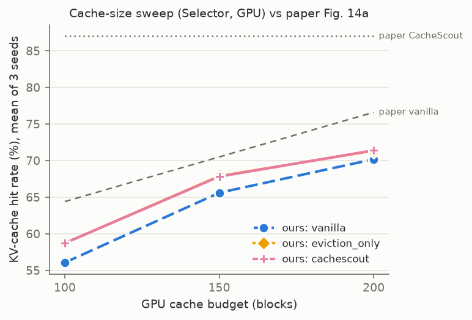
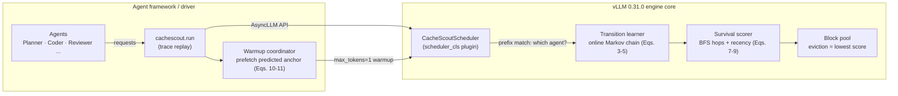

# Agentic KV-Cache Management: a CacheScout replication on vLLM

**Teaching the KV cache which agent runs next: an independent, end-to-end replication of *CacheScout* on a
single 8 GB laptop GPU, with an honest scorecard.**


## TL;DR

- **The paper's claim.** In multi-agent LLM apps, each agent re-sends the same long fixed prefix (system prompt +
  tool definitions). CacheScout learns *which agent tends to run next* and uses that to decide what to keep in
  vLLM's KV cache. The paper reports +10–18 pp cache hit rate and 18–45% lower time-to-first-token (TTFT).
- **What I built.**
  - A working CacheScout inside **real vLLM 0.31.0** as a scheduler plugin (no vLLM files edited).
  - A one-flag on/off switch, ablations and baselines.
  - A vLLM-exact cache simulator, a synthetic multi-agent workload generator and a full benchmarking pipeline.
  - 57 GPU runs on an RTX 4060 Laptop (8 GB).
- **Headline result.**
  - CacheScout raises the KV-cache hit rate over vanilla vLLM in **every** run: **+2.7 / +2.2 / +1.2 pp** at
    100 / 150 / 200 cache blocks (mean of 3 seeds).
  - On a deterministic pipeline workload it reaches **+13.1 pp**, with 8.7% lower mean TTFT.
- **Honest caveat.**
  - The gains are 5–10× smaller than the paper's, there is no consistent speed-up, and two of the paper's claims
    did not reproduce.
  - The positive results depend on two documented interpretations of ambiguous parts of the paper.

<p align="center">
  
</p>
<p align="center"><sub><b>Cache-size sweep on real vLLM (Selector workload, mean of 3 seeds).</b> CacheScout (pink) stays
above vanilla vLLM (blue, dashed) at every budget, and the gap narrows as memory grows, the same direction as the
paper's Fig. 14a (grey reference lines). The gap is much smaller than the paper's. The eviction-only line lies
exactly under CacheScout. Source: <code>results/report/fig_cache_sweep.png</code>,
data in <code>results/report/summary.json</code>.</sub></p>

---

## What is this?

**KV cache, in one paragraph.** When an LLM reads a prompt, it computes "keys and values" for every token: this
is the expensive *prefill* step. vLLM stores them in GPU memory in 16-token **blocks**. If a later prompt starts
with exactly the same tokens, those blocks are reused instead of recomputed (*prefix caching*). GPU memory is
small, so blocks must be **evicted**. vLLM evicts the least recently used block first (LRU).

**Why agents break LRU.** In an agentic app (a planner, a coder, a reviewer, ...), every call to the same agent
begins with that agent's fixed **anchor**: its system prompt and tool definitions. In the paper's workloads,
anchors are 53–62% of all prompt tokens. While other agents run, an idle agent's anchor looks "old" to LRU and
gets evicted just before that agent is called again. CacheScout's idea: learn the agent-to-agent transition
pattern online, and give blocks of *agents likely to run soon* a higher chance of survival.



## What I built

| Component | Where | Notes |
|---|---|---|
| **vLLM scheduler plugin** | `src/cachescout/vllm_plugin/scheduler.py` | Subclass of vLLM's default `AsyncScheduler`, loaded through the official `scheduler_cls` option. Wraps the block pool's lookup, allocation and free paths at runtime. **No vLLM source file is edited.** Neutral mode is verified identical to vanilla on 703/703 requests. |
| **Transition learner + survival scoring** | `src/cachescout/core/` | Paper Eqs. 2–11 and Algorithm 1: online transition counts, thresholded graph, BFS hop distance → survival score, block score `(p_surv+δ)·(e^(−λ·age)+δ)·size(b)`, entropy-gated warmup. |
| **Synthetic agentic workloads** | `src/cachescout/workload/` | Six-agent sessions from the paper's Fig. 5 transition tables (Pipeline, Debate, Selector, Random). They match the paper's predictability R (1.00 / 0.77 / 0.58 / 0.12 vs 1.00 / 0.78 / 0.57 / 0.12) and anchor share (54–62% vs 53–62%). |
| **vLLM-exact simulator** | `src/cachescout/sim/` | Pure-Python replica of vLLM's prefix cache. Matches real vLLM on **703/703** requests for vanilla; used for constant tuning and a Belady upper bound. |
| **Metrics layer** | `src/cachescout/metrics/` | Hit rate, TTFT, per-turn latency and throughput exactly as defined in the paper (Sec. 5.1), cross-checked against vLLM's own counters. |
| **Cache-size sweep + comparison** | `scripts/compare.py` | Runs or loads every system on the same trace, prints a side-by-side table with PASS/FAIL trend checks against the paper, and saves plots. |
| **Overhead microbenchmark** | `scripts/microbench_overhead.py` | State size and hot-path latency for 6 / 12 / 24 agents (paper Fig. 15). |
| **Safe GPU runner** | `scripts/gpu_run.sh` | One GPU job at a time, timeout, memory checks before start, crash-proof memory log (built after a WSL crash). |

## The on/off switch

Same trace, model, seed and cache budget; only the system changes:

```bash
CFG=configs/experiments/main/local.yaml
python -m cachescout.run --config $CFG --system vanilla    --blocks 100   # CacheScout OFF (stock vLLM)
python -m cachescout.run --config $CFG --system cachescout --blocks 100   # CacheScout ON
```

Or in the YAML config (the CLI flag wins if both are given):

```yaml
cachescout:
  enabled: true      # false = vanilla vLLM
  eviction: true     # survival-guided eviction (paper Sec. 3.3)
  warmup: true       # background prefetch (paper Sec. 3.4)
```

Ablations and baselines: `--system eviction_only | warmup_only | continuum`, plus named variants
`--variant cachescout_literal` (Algorithm 1 exactly as written) and `--variant no_prediction` (τ = 0).

## Results

Real vLLM 0.31.0, Qwen2.5-1.5B-Instruct, RTX 4060 Laptop, Selector workload. Each value is the **mean of 3
evaluation seeds** (60 sessions, ~730 LLM calls per run). Source: `results/report/summary.json` (`readme_table`
and `seeds`), which lists every per-run file, e.g.
`results/main/selector_eval/cachescout/b100_eval/result.json`.

| Cache budget | System | Hit rate | Mean TTFT | Mean per-turn latency | Throughput |
|---|---|---|---|---|---|
| 100 blocks | vanilla vLLM | 56.1% | 92.6 ms | 406.3 ms | 6.46 turns/s |
| 100 blocks | **CacheScout** | **58.7%** (+2.7 ± 0.9 pp) | 90.8 ms (−2.1 ± 3.8%) | 401.4 ms (−1.2 ± 2.2%) | 6.46 turns/s |
| 150 blocks | vanilla vLLM | 65.6% | 72.8 ms | 377.7 ms | 6.47 turns/s |
| 150 blocks | **CacheScout** | **67.8%** (+2.2 ± 0.5 pp) | 72.4 ms (−0.5 ± 1.7%) | 378.5 ms (+0.2 ± 1.8%) | 6.46 turns/s |
| 200 blocks | vanilla vLLM | 70.2% | 70.5 ms | 371.7 ms | 6.47 turns/s |
| 200 blocks | **CacheScout** | **71.4%** (+1.2 ± 0.4 pp) | 70.3 ms (−0.3 ± 0.1%) | 371.6 ms (−0.0 ± 0.3%) | 6.47 turns/s |

**Paper vs this replication** (paper: Llama-3.1-8B on 8× RTX PRO 6000; real AutoGen workloads):

| Claim | Paper | This replication | Source |
|---|---|---|---|
| Hit-rate gain over vanilla vLLM | +10 to +18 pp (Fig. 8a) | +1.2 to +2.7 pp (3 seeds); +13.1 pp on Pipeline | `results/report/summary.json` |
| Gain at 100 blocks (Fig. 14a) | 64.4% → 87% | 56.1% → 58.7% | `results/report/summary.json` |
| Gain shrinks as cache grows | yes | yes, on average (2.7 → 2.2 → 1.2 pp) | `results/report/summary.json` |
| Eviction is the main source of gain | yes (Fig. 12) | yes (eviction-only ≈ full) | `results/report/tables.md` |
| Mean TTFT reduction | 18–45% | −0.3% to −2.1% (not consistent); −8.7% on Pipeline | `results/report/summary.json` |
| Throughput gain | +19–57% | none measured | `results/report/tables.md` |
| Gains vanish under random routing | yes (Tab. 1) | **no** (+3.3 / +5.0 pp) | `results/main/random_eval/` |
| Next-agent prediction accuracy | 76–86% | 76% | `results/report/summary.json` (`engine`) |
| Runtime overhead | ~1–6 µs | 37–234 µs (pure Python) | `results/microbench/overhead.json` |

More: topology and load-sweep tables in `results/report/tables.md`, the per-topology figure
`results/report/fig_topologies.png`, and the full analysis in [`docs/REPORT.md`](docs/REPORT.md).

## What reproduced, and what did not

**Reproduced (direction and ordering)**
- CacheScout's hit rate beats vanilla vLLM at every budget, in all 9 seed × budget runs (+0.8 to +3.5 pp).
- The gain is largest at small cache sizes and shrinks as memory grows (on average over seeds).
- Survival-guided eviction is the main source of gain; warmup alone adds about 1 pp or less (+0.5 to +1.1).
- The online transition learner reaches the paper's accuracy range (76%) and the learned predictability R
  matches the workload's.

**Did not reproduce**
- **Magnitude.** Hit-rate gains are positive but roughly 5–10× smaller than the paper's.
- **Speed.** No consistent TTFT, latency or throughput improvement on the main workload. The only clear TTFT gain
  is on the deterministic Pipeline workload (−8.7%). Likely cause: with a 1.5B model and ~340-token prompts,
  skipping a few prefill tokens saves almost no time.
- **Random routing.** Gains do *not* vanish under random agent routing (+3.3 / +5.0 pp).
- **Prediction.** A variant with prediction switched off (τ = 0) is as good as full CacheScout. On this workload
  the gain comes from protecting shared anchor blocks over session history, not from predicting the next agent.
- **Continuum baseline.** My Continuum-style baseline (0.3 s TTL pinning) is a flawed approximation: it protects
  exactly the blocks LRU already keeps, so it equals vanilla. It is not a faithful reproduction of the authors'
  Continuum.

**Results depend on two documented interpretations** ([`docs/decisions.md`](docs/decisions.md)):
1. Agent transitions are learned per session. Algorithm 1's single global "current agent" learns noise when
   about 8 sessions interleave.
2. Only anchor blocks (shared by ≥ 2 sessions) inherit survival scores, not session history.

Algorithm 1 implemented literally gained only +0.4 / +0.1 / −1.0 pp.

## Quickstart

**Prerequisites:** Windows 11 + WSL2 (Ubuntu) or native Linux, an NVIDIA GPU (8 GB is enough), an existing
Python 3.12 environment with **vLLM 0.31.0**, and the model `Qwen/Qwen2.5-1.5B-Instruct` in your Hugging Face
cache.

```bash
git clone https://github.com/MostafaaElhadidy/Agentic-KV-Cache-Management.git
cd Agentic-KV-Cache-Management
source ~/your-vllm-env/bin/activate            # an environment that already has vllm==0.31.0
pip install -r requirements-extra.txt          # or: uv pip install -r ...  (pytest, ruff, pyyaml, matplotlib)

pytest -q                                       # 86 tests, no GPU needed
python scripts/make_traces.py                  # regenerate the synthetic traces (deterministic seeds)
python scripts/compare.py --config configs/experiments/main/local.yaml --blocks 100,150,200 --sim   # no GPU
```

**Reproduce the main result on a GPU.** On an 8 GB GPU, always go through the safe wrapper. It refuses to start
if another GPU job is running and logs memory every 2 s to `logs/`.

```bash
CFG=configs/experiments/main/local.yaml
scripts/gpu_run.sh off 1800 python -m cachescout.run --config $CFG --system vanilla    --blocks 100
scripts/gpu_run.sh on  1800 python -m cachescout.run --config $CFG --system cachescout --blocks 100
python scripts/compare.py --config $CFG --systems vanilla,cachescout --blocks 100   # table + plot
bash scripts/run_all_local.sh && python scripts/aggregate_report.py                 # full campaign, ~2 h
```

Each run takes about 2 minutes and writes `results/main/<trace>/<system>/b<blocks>_<tag>/result.json`, which
holds the config, git commit, package versions, every request and a summary. Never run two GPU jobs at once.

## Hardware and environment

| | |
|---|---|
| GPU | NVIDIA RTX 4060 Laptop, 8 GB (≈0.4 GB used by the Windows desktop) |
| OS | Windows 11 + WSL2, Ubuntu 26.04, 11 GiB RAM / 16 GiB swap for WSL |
| Software | Python 3.12.15, vLLM 0.31.0, torch 2.13.0+cu132 (CUDA 13.2), transformers 5.17.0 |
| Model | Qwen2.5-1.5B-Instruct (bf16), stand-in for the paper's Llama-3.1-8B |

8 GB-specific settings (`configs/hardware/local.yaml`), applied identically to every compared system:

| Setting | Value | Why |
|---|---|---|
| `enforce_eager` | `true` | Avoids torch.compile autotuning and CUDA-graph memory spikes. |
| `num_gpu_blocks_override` | 100–256 | vLLM's automatic KV sizing tried a 1.23 GiB allocation and ran out of memory. A fixed block count also gives exactly the paper's 100–200 block budgets. vLLM reserves one block, so 256 means 255 usable. |
| `max_model_len` | 1584 | Fits one request into the smallest budget ((100 − 1) × 16 tokens). |
| `max_num_batched_tokens` | 2048 | Lower start-up memory peak. |

## Repository structure

```
src/cachescout/
  core/          transition learner, survival scorer, Algorithm 1 runtime, warmup coordinator
  vllm_plugin/   CacheScoutScheduler (vLLM scheduler_cls hook)
  sim/           vLLM-exact prefix-cache simulator
  workload/      Fig. 5 topologies, trace generator, trace statistics
  metrics/       TurnRecord, summaries (paper Sec. 5.1 metrics)
  run.py         experiment runner (the on/off switch)
configs/         hardware (local/cloud), traces, experiments
scripts/         compare.py, gpu_run.sh, run_all_local.sh, aggregate_report.py, tuning, checks
results/         tracked results cited by the docs (raw logs and regenerable traces are git-ignored)
docs/            REPORT, WORK_LOG, decisions, open questions, paper notes, vLLM internals, cloud runbook
tests/           86 pytest tests (no GPU)
paper/           the paper PDF (CC BY 4.0) and attribution
```

## Limitations

- **Small model, short prompts.** Prefill is cheap at 1.5B parameters and ~340 tokens, which likely hides any
  latency benefit.
- **Synthetic workloads.** Real AutoGen runs and datasets were not used. Session-history reuse is much lower than
  in the paper (≈1 vs 12–15 reuses per block), and requests are smaller (≤ 44 vs ~93 blocks).
- **Guessed constants and two interpretations.** The paper gives no values for ε, τ, E_max, λ, δ or R_min. They
  were tuned on separate tuning traces, never on the evaluation traces.
- **Statistics.** 3 seeds for the main sweep; single seed for topologies, load and extra ablations. Run-to-run
  noise of identical configurations was not measured.
- **Version and implementation.** vLLM 0.31.0 instead of the paper's v0.11; a pure-Python runtime (overhead is
  not representative).

## Roadmap

- **Cloud phase** (prepared, not run): Llama-3.1-8B on an A100/H100, the same sweeps up to 50 sessions/s. Exact
  commands are in [`docs/CLOUD_RUNBOOK.md`](docs/CLOUD_RUNBOOK.md).
- **Real AutoGen SelectorGroupChat traces** with an 8B model, to test the workload deviations above.
- **Faster runtime:** cached per-agent scores and a heap instead of a full scan, toward the paper's µs overhead.

## Documentation

- [`docs/REPORT.md`](docs/REPORT.md): full results and analysis, every number linked to a result file
- [`docs/WORK_LOG.md`](docs/WORK_LOG.md): chronological log of every step, failure and fix
- [`docs/decisions.md`](docs/decisions.md) and [`docs/open_questions.md`](docs/open_questions.md): every choice
  not given by the paper
- [`docs/paper_notes.md`](docs/paper_notes.md): equations, Algorithm 1, settings table, paper inconsistencies
- [`docs/vllm_internals.md`](docs/vllm_internals.md): vLLM 0.31.0 internals used by the hook, with file:line
  references
- [`docs/CLOUD_RUNBOOK.md`](docs/CLOUD_RUNBOOK.md): step-by-step cloud reproduction

## Citation and acknowledgements

This is an **independent, unofficial replication**. It is not affiliated with or endorsed by the paper's
authors. All credit for the CacheScout design goes to them:

> Rui Zhang, Chaeeun Kim, Shaoting Feng, Kuntai Du, Yuhan Liu, Yi Zhong, Cheng-Wei Ching, Junchen Jiang, Liting Hu.
> **"Learning Agent Execution for KV-Cache Management in Agentic Serving."** arXiv:2608.14624, 2026.
> https://arxiv.org/abs/2608.14624

Built on [vLLM](https://github.com/vllm-project/vllm). The paper PDF in `paper/` is redistributed under its
CC BY 4.0 license. The code in this repository is MIT-licensed ([`LICENSE`](LICENSE)).
